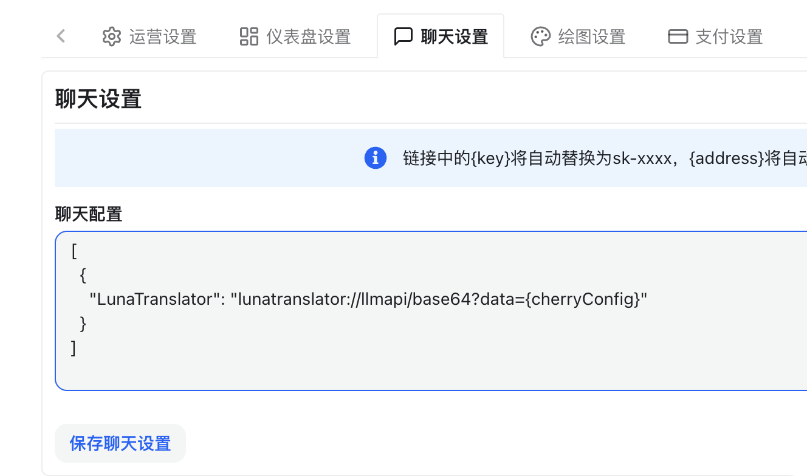
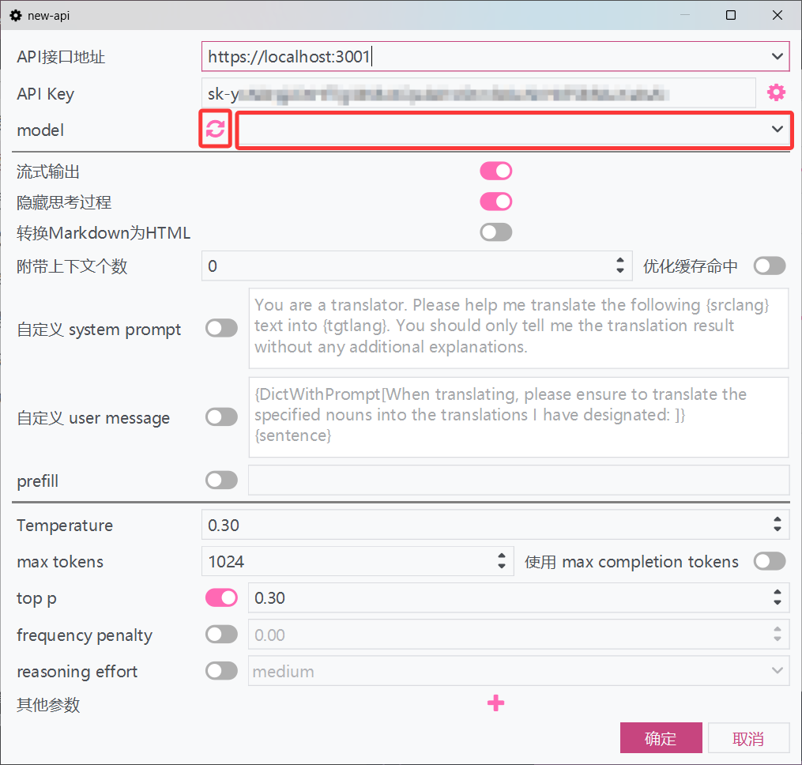
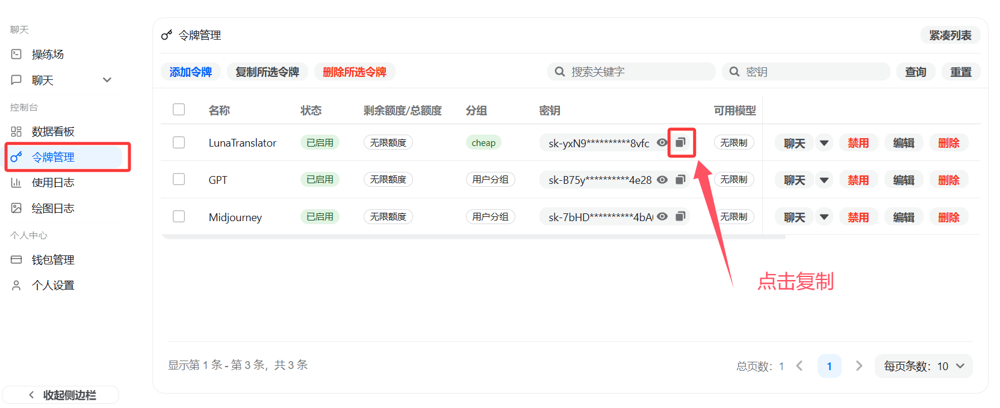
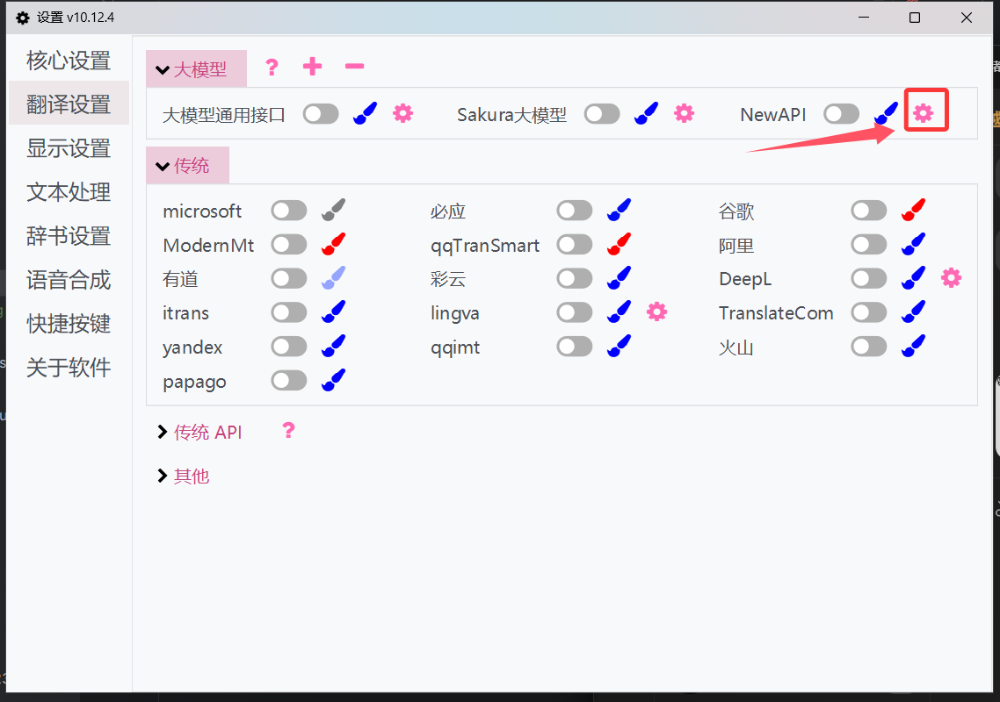
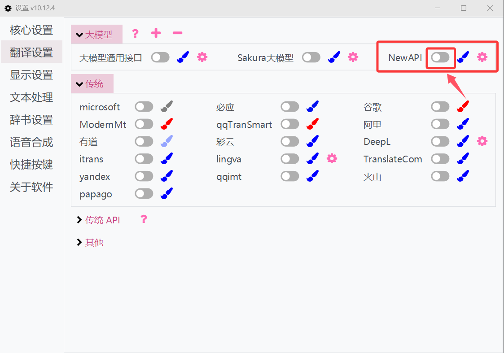

# LunaTranslator - 开源 GalGame 翻译器
!!! tip "聊天设置选项"
    在 New API 控制台的系统设置->聊天设置中，可添加如下快捷选项，便于在令牌管理页一键填充到 LunaTranslator：

    ```json
    { "LunaTranslator": "lunatranslator://llmapi/base64?data={cheryConfig}" }
    ```

!!! info
    LunaTranslator 是一款开源免费的视觉小说（GalGame）翻译器，致力于提供母语级别的视觉小说游玩体验。

    - 项目地址：<https://github.com/HIllya51/LunaTranslator>
    - 项目文档：<https://docs.lunatranslator.org/zh/README.html>

## 功能支持

- **HOOK** 主要使用HOOK提取游戏文本，几乎适配了所有的常见和冷门的视觉小说

- **内嵌翻译** 部分游戏还可以直接内嵌翻译到游戏中，以获取沉浸式体验

- **HOOK模拟器** 对NS/PSP/PSV/PS2上的大部分游戏，支持HOOK模拟器直接读取游戏文本

- **OCR** 内置较高精度的OCR模型，并支持许多其他在线&离线OCR引擎，以便灵活的读取任意文本

- **丰富的翻译接口** 支持几乎所有翻译引擎，包括大语言模型翻译、离线翻译等

- **语言学习** 支持日语分词及假名注音，支持AnkiConnect，支持Yomitan插件

- **语音合成** 支持大量在线&离线语音合成引擎

- **语音识别** 在Windows 10和Windows 11上，可以使用Windows语音识别。

## 安装方式 

在 [LunaTranslator 文档- 下载 & 启动 & 更新](https://docs.lunatranslator.org/zh/README.html) 进行下载安装

## 在 LunaTranslator 接入 NewAPI

LunaTranslator 支持接入本地部署的 NewAPI 和第三方使用 NewAPI 搭建的 NewAPI 服务。

### 一键配置
1. 在 New API 控制台的`系统设置`->`聊天设置`中，添加如下快捷选项：
    ```json
    { "LunaTranslator": "lunatranslator://llmapi/base64?data={cheryConfig}" }
    ```
    

2. 在 **`NewAPI`** -> `控制台` -> `令牌管理` 选项卡中选择要使用在 LunaTranslator 的令牌，点击聊天按钮旁的下拉选项，选择 `LunaTranslator`,将会跳转到 LunaTranslator 并自动配置 API 地址与 API Key


3. 在 **`LunaTranslator`** -> `设置` -> `翻译设置` -> `大模型` 中将出现一个新增的大模型接口配置，点击编辑


4. 点击 **model** 下拉框旁的刷新按钮，获取 NewAPI 平台的模型列表，选择或输入模型名称，完成后点击确定保存


5. 检查 **new_api** 大模型接口配置旁边的开关按钮是否打开，若未启用则启用接口即可开始使用


### 手动配置

1. 在 **`NewAPI`** -> `控制台` -> `令牌管理` 选项卡中获取 API Key


2. 在 **`LunaTranslator`** -> `设置` - `翻译设置` -> `大模型` 中选择添加


3. 复制 **大模型通用接口** 模板，新增接口


4. 在 **新增的接口** 中，填写对应的 API 地址和 API Key



5. 点击 **model** 下拉框旁的刷新按钮，获取 NewAPI 平台的模型列表，选择或输入模型名称，完成后点击确定保存


6. 点击 **NewAPI** 旁边的开关按钮，启用接口即可开始使用


更多使用方式请查看 LunaTranslator 官方文档:[LunaTranslator 文档 - 大模型翻译接口](https://docs.lunatranslator.org/zh/guochandamoxing.html)