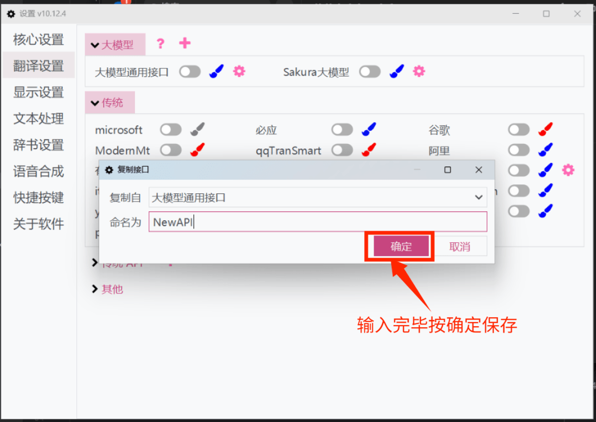
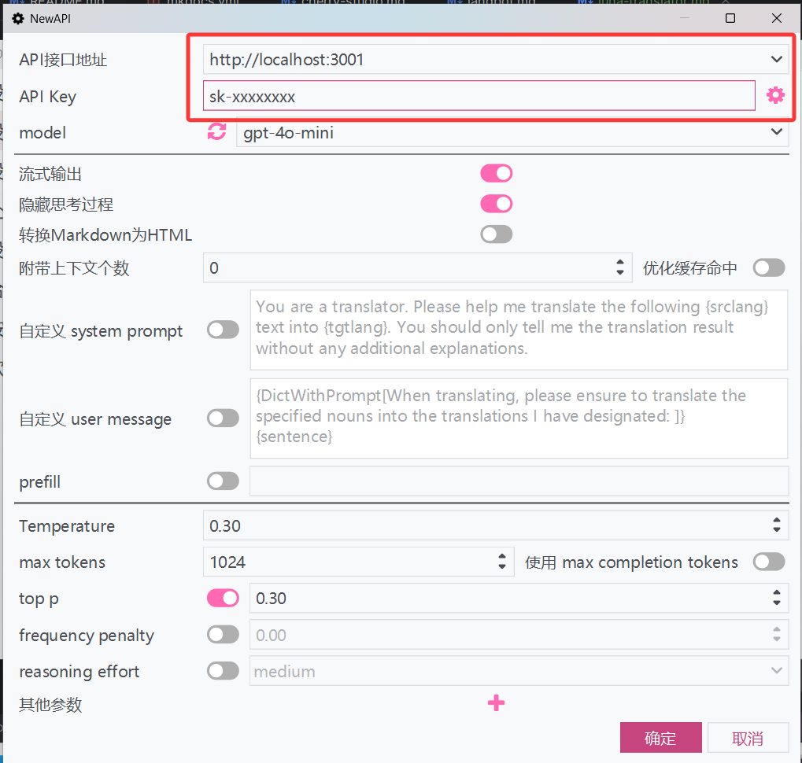

# LunaTranslator - Open Source GalGame Translator

!!! tip "Chat Settings Option"
    In the New API dashboard, under `System Settings` -> `Chat Settings`, you can add the following shortcut option. This allows you to easily configure LunaTranslator with a single click from the Token Management page:

    ```json
    { "LunaTranslator": "lunatranslator://llmapi/base64?data={cheryConfig}" }
    ```

!!! info
    LunaTranslator is an open-source and free GalGame translator dedicated to providing a native-level GalGame gameplay experience.

    - Project Repository: <https://github.com/HIllya51/LunaTranslator>
    - Documentation：<https://docs.lunatranslator.org/zh/README.html>
## Features

- **HOOK** Primarily uses HOOK to extract game text, compatible with almost all common and niche GalGames.

- **In-game Translation** Some games support direct in-game translation for an immersive experience.

- **Emulator HOOK** For most games on NS/PSP/PSV/PS2, it supports hooking emulators to directly read game text.

- **OCR** Features a built-in high-accuracy OCR model and supports many other online & offline OCR engines for flexible text extraction.

- **Rich Translation APIs** Supports almost all translation engines, including Large Language Models (LLMs), offline translation, etc.

- **Language Learning** Supports Japanese word segmentation and furigana annotation, AnkiConnect, and the Yomitan plugin.

- **Text-to-Speech (TTS)** Supports a large number of online & offline text-to-speech engines.

- **Speech Recognition** On Windows 10 and Windows 11, Windows Speech Recognition can be used.

## Installation

Please download and install from the official documentation: [LunaTranslator Docs - Download & Launch & Update](https://docs.lunatranslator.org/en/README.html)

## Using NewAPI in LunaTranslator

LunaTranslator supports integration with locally deployed NewAPI instances and third-party services built on NewAPI.

### One-Click Configuration

1.  In the New API dashboard, go to `System Settings` -> `Chat Settings` and add the following shortcut option:
    ```json
    { "LunaTranslator": "lunatranslator://llmapi/base64?data={cheryConfig}" }
    ```
    

2.  In the **`NewAPI`** -> `Dashboard` -> `Token Management` tab, select the token you want to use in LunaTranslator. Click the dropdown option next to the chat button and select `LunaTranslator`. This will redirect you to the LunaTranslator application and automatically configure the API Address and API Key.
    

3.  In **`LunaTranslator`** -> `Settings` -> `Translation Settings` -> `Large Language Model`, a new API configuration will be automatically added. Click the edit button to proceed.
    

4.  Click the refresh button next to the **model** dropdown to fetch the list of models from the NewAPI platform. Select or enter a model name, then click OK to save.
    

5.  Check the toggle switch next to the **new_api** large model configuration. If it's off, turn it on to start using the API.
    

### Manual Configuration

1.  In **`NewAPI`** -> `CONSOLE` -> `Token Management` tab to get your API Key.

    

2.  In **`LunaTranslator`** -> `Settings` -> `Translation Settings` -> `Large Language Model` and click "Add".

    

3.  Copy the **Generic Large Model API** template to create a new API configuration.

    

4.  In the **NewAPI** configuration window, fill in your API Address and API Key.

    
    

5.  Click the refresh button next to the **model** dropdown to fetch the list of models from the NewAPI platform. Select or enter a model name, then click OK to save.

    

6.  Click the toggle button next to **NewAPI** to enable the API and start using it.

    

For more usage details, please refer to the official LunaTranslator documentation: [LunaTranslator Docs - Large Model Translation API](https://docs.lunatranslator.org/en/guochandamoxing.html)