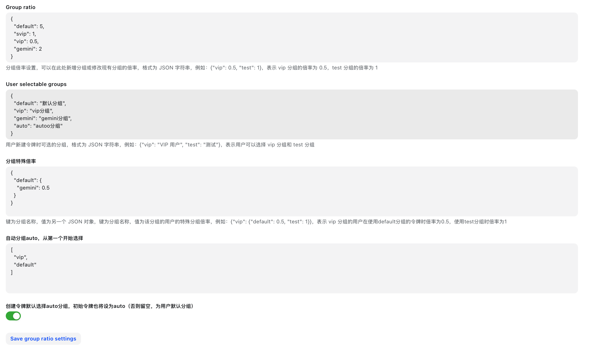
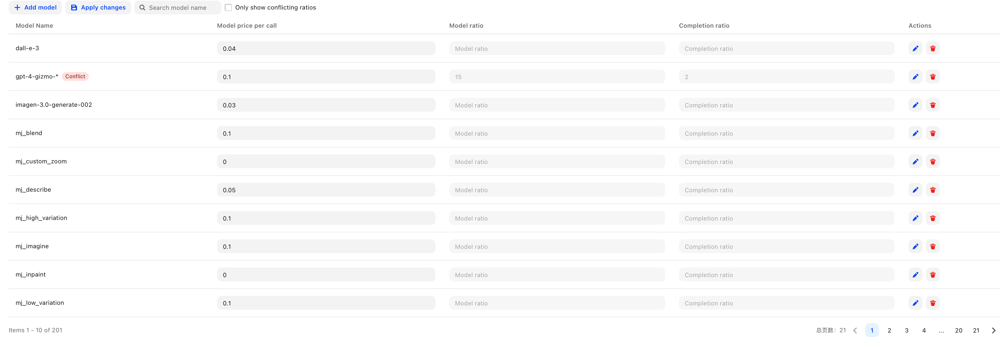

# Rate Settings

Rate settings are the core configuration of the NewAPI billing system, allowing flexible control over billing standards for different models and user groups through various rate multipliers.

## Rate System Overview

NewAPI uses a three-tier rate system to calculate user quota consumption:

1. Model Rate (ModelRatio) - Defines the base billing multiplier for different AI models
2. Completion Rate (CompletionRatio) - Additional billing adjustment for output tokens
3. Group Rate (GroupRatio) - Differential billing multipliers for different user groups

### Relationship Between Quota and Rates

In the New API system, rates are key parameters for calculating quota consumption. Quota is the internal billing unit of the system, and all API calls are ultimately converted to quota points for deduction.

Quota Unit Conversion:

- 1 USD = 500,000 quota points
- Quota points are the basic unit for internal system billing
- User balances and consumption records are based on quota points

### Quota Calculation Formulas

#### Pay-per-use Models (Based on Token Consumption)

```
Quota Consumption = (Input Tokens + Output Tokens × Completion Rate) × Model Rate × Group Rate
```

#### Pay-per-request Models (Fixed Price)

```
Quota Consumption = Model Fixed Price × Group Rate × Quota Unit (500,000)
```

#### Audio Models (Special Handling, Automatically Processed by New-API)

```
Quota Consumption = (Text Input Tokens + Text Output Tokens × Completion Rate + Audio Input Tokens × Audio Rate + Audio Output Tokens × Audio Rate × Audio Completion Rate) × Model Rate × Group Rate
```

#### Pre-consumption and Post-consumption Mechanism

New API uses a dual billing mechanism of pre-consumption and post-consumption:

1. Pre-consumption Phase: Before API call, calculate quota consumption based on estimated tokens and pre-deduct
2. Post-consumption Phase: After API call completion, recalculate quota consumption based on actual tokens
3. Difference Adjustment: If actual consumption differs from pre-consumption, the system automatically adjusts user quota balance

```
Pre-consumption Quota = Estimated Tokens × Model Rate × Group Rate
Actual Quota = Actual Tokens × Model Rate × Group Rate
Quota Adjustment = Actual Quota - Pre-consumption Quota
```

## Model Rate Settings

Model rates define the base billing multipliers for different AI models, with system-preset default rates for various models.

### Common Model Rate Examples

| Model Name | Model Rate | Completion Rate | Official Price (Input) | Official Price (Output) |
|------------|------------|-----------------|------------------------|-------------------------|
| gpt-4o | 1.25 | 4 | $2.5/1M Tokens | $10/1M Tokens |
| gpt-3.5-turbo | 0.25 | 1.33 | $0.5/1M Tokens | $1.5/1M Tokens |
| gpt-4o-mini | 0.075 | 4 | $0.15/1M Tokens | $0.6/1M Tokens |
| o1 | 7.5 | 4 | $15/1M Tokens | $60/1M Tokens |

Rate Meaning Explanation:

- Model Rate: Multiplier relative to the base billing unit, reflecting model cost differences
- Completion Rate: Billing multiplier for output tokens relative to input tokens, reflecting output cost differences
- Higher rates consume more quota; lower rates consume less quota

### Configuration Methods

1. JSON Format: Directly edit model rate JSON configuration
2. Visual Editor: Set rates through graphical interface


## Completion Rate Settings

Completion rates are used for additional billing adjustments on output tokens, mainly to balance the cost differences between input and output for different models.

### Default Completion Rates

| Model Type | Official Price (Input) | Official Price (Output) | Completion Rate | Description |
|------------|------------------------|-------------------------|-----------------|-------------|
| gpt-4o | $2.5/1M Tokens | $10/1M Tokens | 4 | Output is 4x the input price |
| gpt-3.5-turbo | $0.5/1M Tokens | $1/1M Tokens | 2 | Output is 2x the input price |
| gpt-image-1 | $5/1M Tokens | $40/1M Tokens | 8 | Output is 8x the input price |
| gpt-4o-mini | $0.15/1M Tokens | $0.6/1M Tokens | 4 | Output is 4x the input price |
| Other models | 1 | 1 | 1 | Equal billing for input and output |

### Configuration Notes

- Completion rates mainly affect output token billing
- Setting to 1 means output token billing is the same as input token billing
- Greater than 1 means higher output token billing, less than 1 means lower output token billing

## Group Rate Settings

Group rates allow setting differential billing multipliers for different user groups, enabling flexible pricing strategies.

### Group Rate Configuration

```json
{
  "vip": 0.5,
  "premium": 0.8,
  "standard": 1.0,
  "trial": 2.0
}
```

### Group Rate Priority

1. User-specific Rate: Personal rate set for specific users
2. Group Rate: Rate for the user's group
3. Default Rate: System default rate (usually 1.0)



## Visual Rate Settings

The visual editor provides an intuitive rate management interface, supporting:

- Batch editing of model rates
- Real-time rate configuration preview
- Conflict detection and alerts
- One-click upstream rate synchronization



## Models Without Rate Settings

For models without rate settings, the system will:

1. Self-use Mode: Use default rate of 37.5
2. Business Mode: Show "Rate or price not configured" error
3. Auto Detection: Display unconfigured models in management interface


## Upstream Rate Synchronization

The system supports automatic rate synchronization from upstream channels:

- Automatically fetch upstream model rates
- Batch update local rate configurations
- Maintain synchronization with upstream pricing
- Support manual adjustment and override


## Frequently Asked Questions

### Q: How to set rates for new models?

A: You can add new models through the visual editor or directly add them to JSON configuration. It's recommended to start with conservative rates and adjust based on actual usage.

### Q: How do group rates take effect?

A: Group rates multiply with model rates, ultimately affecting user quota consumption calculation. User's actual rate = Model Rate × Group Rate.

### Q: What is the purpose of completion rates?

A: Completion rates are mainly used to balance the cost differences between input and output tokens. Some models have much higher output costs than input costs, requiring adjustment through completion rates.

### Q: How to batch set rates for similar models?

A: You can use the visual editor for batch operations, or directly add rate settings for similar models in JSON configuration.

## Quota Calculation Examples

### Example 1: GPT-4 Standard User Conversation

Scenario Parameters:

- Input tokens: 1,000
- Output tokens: 500
- Model rate: 15
- Completion rate: 2
- Group rate: 1.0 (standard user)

Calculation Process:
```
Quota Consumption = (1,000 + 500 × 2) × 15 × 1.0
                  = (1,000 + 1,000) × 15
                  = 2,000 × 15
                  = 30,000 quota points
```

Equivalent USD Cost: 30,000 ÷ 500,000 = $0.06

### Example 2: GPT-3.5 VIP User Conversation

Scenario Parameters:

- Input tokens: 2,000
- Output tokens: 1,000
- Model rate: 0.25
- Completion rate: 1.33
- Group rate: 0.5 (VIP user 50% discount)

Calculation Process:
```
Quota Consumption = (2,000 + 1,000 × 1.33) × 0.25 × 0.5
                  = (2,000 + 1,330) × 0.125
                  = 3,330 × 0.125
                  = 416.25 quota points
```

Equivalent USD Cost: 416.25 ÷ 500,000 = $0.00083

### Example 3: Pay-per-request Model (e.g., Midjourney)

Scenario Parameters:

- Model fixed price: $0.02
- Group rate: 1.0 (standard user)
- Quota unit: 500,000

Calculation Process:
```
Quota Consumption = 0.02 × 1.0 × 500,000
                  = 10,000 quota points
```

Equivalent USD Cost: 10,000 ÷ 500,000 = $0.02

For more billing rules, please refer to the [FAQ](../support/faq.md) 