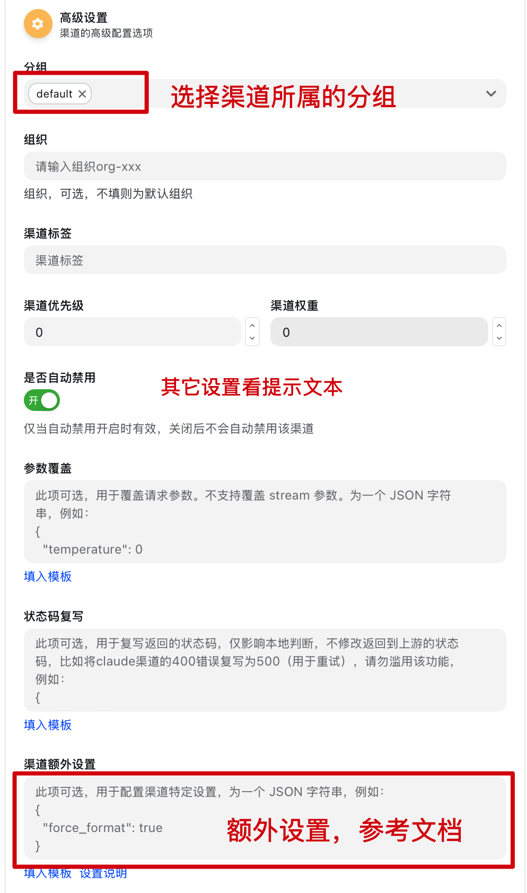

# 渠道

在这里可以管理 NewAPI 的上游渠道


## 渠道创建/编辑页面




## 参数覆盖设置


### 简单覆盖模式

向前兼容性，直接指定要覆盖的字段和值，系统会将这些字段合并到原始请求中

```json
{
  "temperature": 0.8,
  "max_tokens": 2000,
  "model": "gpt-4"
}
```

### 高级操作模式

通过 `operations` 数组定义复杂的参数操作，支持条件判断、数组操作、字符串拼接等高级功能

#### 基本结构

```json
{
  "operations": [
    {
      "path": "temperature",
      "mode": "set",
      "value": 0.8,
      "conditions": [...],
      "logic": "AND"
    }
  ]
}
```

### 操作模式 (mode)

#### 1. set - 设置值
设置指定路径的值

```json
{
  "path": "temperature",
  "mode": "set",
  "value": 0.8,
  "keep_origin": false
}
```

**参数说明：**
- `keep_origin`: 为 `true` 时，如果目标路径已存在值则跳过设置

#### 2. delete - 删除字段
删除指定路径的字段

```json
{
  "path": "messages.0",
  "mode": "delete"
}
```

#### 3. move - 移动字段
将一个字段的值移动到另一个位置

```json
{
  "mode": "move",
  "from": "messages.0.content",
  "to": "system"
}
```

#### 4. append - 追加内容
在现有内容后追加新内容

```json
{
  "path": "messages.0.content",
  "mode": "append",
  "value": "\n\n请用中文回答。"
}
```

**支持的数据类型：**
- **字符串**: 在原字符串末尾追加
- **数组**: 在数组末尾添加元素
- **对象**: 合并对象属性

#### 5. prepend - 前置内容
在现有内容前添加新内容

```json
{
  "path": "messages.0.content",
  "mode": "prepend",
  "value": "重要提示：请仔细阅读以下内容。\n\n"
}
```

### 条件判断

通过 `conditions` 数组设置操作执行的条件，只有满足条件时才会执行操作

#### 条件结构

```json
{
  "conditions": [
    {
      "path": "model",
      "mode": "contains",
      "value": "gpt-4"
    }
  ],
  "logic": "AND"
}
```

#### 条件匹配模式

- `full`: 完全匹配（默认）
- `prefix`: 前缀匹配
- `suffix`: 后缀匹配
- `contains`: 包含匹配

#### 逻辑关系 (logic)

- `AND`: 所有条件都必须满足
- `OR`: 任意条件满足即可（默认）

### 路径语法

使用 JSON 路径语法访问嵌套字段：

- `temperature` - 根级字段
- `messages.0.content` - 数组第一个元素的 content 字段
- `messages.-1.content` - 数组最后一个元素的 content 字段
- `metadata.user.name` - 嵌套对象字段

### 实用示例

#### 1. 动态调整模型参数

```json
{
  "operations": [
    {
      "path": "temperature",
      "mode": "set",
      "value": 0.3,
      "conditions": [
        {
          "path": "messages.0.content",
          "mode": "contains",
          "value": "代码"
        }
      ]
    },
    {
      "path": "temperature",
      "mode": "set",
      "value": 0.9,
      "conditions": [
        {
          "path": "messages.0.content",
          "mode": "contains",
          "value": "创意"
        }
      ]
    }
  ]
}
```

#### 2. 添加系统提示

```json
{
  "operations": [
    {
      "path": "messages",
      "mode": "prepend",
      "value": [
        {
          "role": "system",
          "content": "你是一个专业的AI助手，请始终保持礼貌和专业。"
        }
      ]
    }
  ]
}
```

#### 3. 根据模型类型调整参数

```json
{
  "operations": [
    {
      "path": "max_tokens",
      "mode": "set",
      "value": 4000,
      "conditions": [
        {
          "path": "model",
          "mode": "prefix",
          "value": "gpt-4"
        }
      ]
    },
    {
      "path": "max_tokens",
      "mode": "set",
      "value": 2000,
      "conditions": [
        {
          "path": "model",
          "mode": "prefix",
          "value": "gpt-3.5"
        }
      ]
    }
  ]
}
```

#### 4. 多条件组合

```json
{
  "operations": [
    {
      "path": "stream",
      "mode": "set",
      "value": false,
      "conditions": [
        {
          "path": "model",
          "mode": "contains",
          "value": "claude"
        },
        {
          "path": "messages.0.content",
          "mode": "contains",
          "value": "长文"
        }
      ],
      "logic": "AND"
    }
  ]
}
```

### 注意事项

1. **执行顺序**: 操作按照在 `operations` 数组中的顺序依次执行,且前者可影响后者结果
2. **路径有效性**: 确保指定的路径在 JSON 结构中存在，否则操作可能失败
3. **类型兼容性**: 追加和前置操作需要确保数据类型兼容
4. **条件检查**: 条件检查在每个操作执行前进行，基于当前的 JSON 状态
5. **错误处理**: 如果高级操作模式失败，系统会自动回退到简单覆盖模式